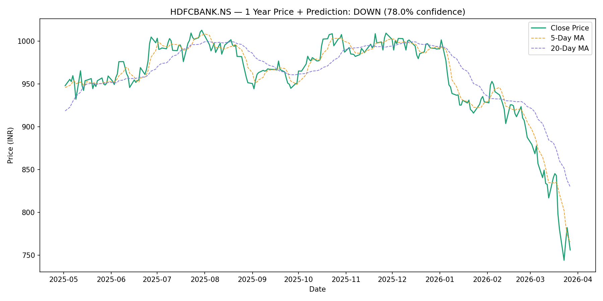

# Stock Sentiment Analyzer

A web app that predicts whether any NSE listed stock will go UP or DOWN the next trading day. Built with live news scraping, NLP sentiment analysis, and machine learning.

---

## Live Demo

Type any NSE stock ticker, hit Run Analysis, and get a full prediction in seconds.



---

## What It Does

You open the web app in your browser, enter a stock ticker like RELIANCE.NS or HDFCBANK.NS, and click Run Analysis. The app then:

1. Downloads 1 year of real stock price data from Yahoo Finance
2. Scrapes today's live news headlines from Google News
3. Scores each headline using VADER NLP sentiment analysis
4. Trains an XGBoost classifier on price and sentiment features
5. Predicts tomorrow's direction with a confidence score
6. Shows a 1 year price chart with moving averages
7. Runs a backtest simulator on Rs 1,00,000 starting capital

Everything runs in the browser. No terminal needed after setup.

---

## How It Evolved

This project started as a basic script and was improved across three versions.

Version 1 used 8 hardcoded headlines and a Random Forest model. Accuracy was 45.65%.

Version 2 replaced the static headlines with live Google News scraping and added support for any NSE stock ticker. Accuracy jumped to 54.35% just from using real data.

Version 3 upgraded the model to XGBoost, added a backtesting simulator, and wrapped everything in a Streamlit web dashboard.

---

## Tech Stack

| Tool | Purpose |
|---|---|
| Python 3.13 | Core language |
| Streamlit | Web dashboard |
| yfinance | Live stock price data |
| feedparser | Live news from Google News RSS |
| vaderSentiment | NLP sentiment scoring |
| XGBoost | ML classifier |
| scikit-learn | Train/test split and evaluation |
| matplotlib | Price chart and backtest chart |
| pandas | Data manipulation |

---

## Setup

### 1. Clone the repo

```bash
git clone https://github.com/Sankyy-14/Stock-Sentiment-Analyser.git
cd Stock-Sentiment-Analyser
```

### 2. Create and activate virtual environment

```bash
python -m venv venv

# Windows
venv\Scripts\activate

# Mac / Linux
source venv/bin/activate
```

### 3. Install dependencies

```bash
pip install streamlit yfinance feedparser vaderSentiment xgboost scikit-learn matplotlib pandas
```

### 4. Run the web app

```bash
streamlit run app.py
```

A browser tab opens at localhost:8501. Enter any NSE ticker and click Run Analysis.

### Run as a script instead

If you prefer the terminal version without the web app:

```bash
python main.py
```

---

## Supported Tickers

Any NSE or BSE listed stock. A few examples:

| Company | Ticker |
|---|---|
| Reliance Industries | RELIANCE.NS |
| TCS | TCS.NS |
| HDFC Bank | HDFCBANK.NS |
| Infosys | INFY.NS |
| Wipro | WIPRO.NS |
| State Bank of India | SBIN.NS |
| Bajaj Finance | BAJFINANCE.NS |

---

## How It Works

### Live news scraping
The app searches Google News RSS for today's headlines using the stock name. No API key needed. It pulls the 10 most recent articles and scores each one.

### Sentiment scoring
VADER NLP gives each headline a compound score from -1.0 (very negative) to +1.0 (very positive). The average across all headlines becomes one of the model's input features.

### Feature engineering
Four features go into the model: daily price change percentage, 5 day moving average, 20 day moving average, and the sentiment score. These are computed fresh every time the app runs.

### XGBoost classifier
The model trains on an 80/20 split of 1 year of daily data. XGBoost is the standard algorithm used in financial ML for tabular data and consistently outperforms Random Forest on this task.

### Backtesting
The simulator runs through the test set predictions and tracks what would happen if you bought on every UP signal and sold on every DOWN signal starting with Rs 1,00,000. It shows the final portfolio value and total return percentage.

---

## Model Performance

| Version | Sentiment Source | Model | Accuracy |
|---|---|---|---|
| v1 | Static headlines | Random Forest | 45.65% |
| v2 | Live Google News | Random Forest | 54.35% |
| v3 | Live Google News | XGBoost | Varies by stock |

Stock prediction is hard. Even professional quant funds rarely exceed 55% on short term daily predictions. The goal of this project is a working end to end pipeline, not a trading bot.

---

## What Is Next

- FinBERT instead of VADER for more accurate financial sentiment
- Deploy on Streamlit Cloud so anyone can access it online
- Email or WhatsApp alerts when the model predicts a big move
- Support for US stocks via Yahoo Finance

---

## Course Context

Built as a BYOP capstone project for an AI/ML course. Started from zero Python knowledge and grew into a full web application over multiple iterations.

---

## License

MIT — free to use and build on.
